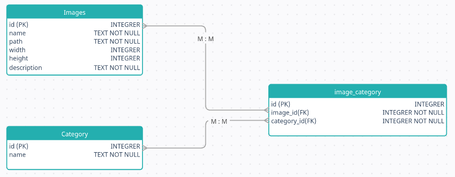
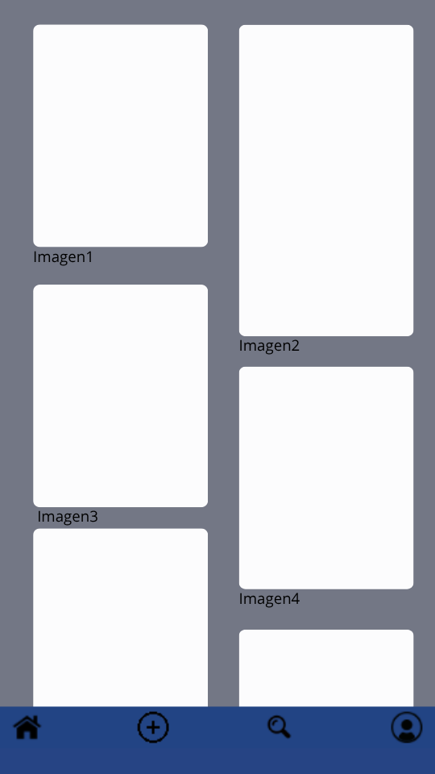
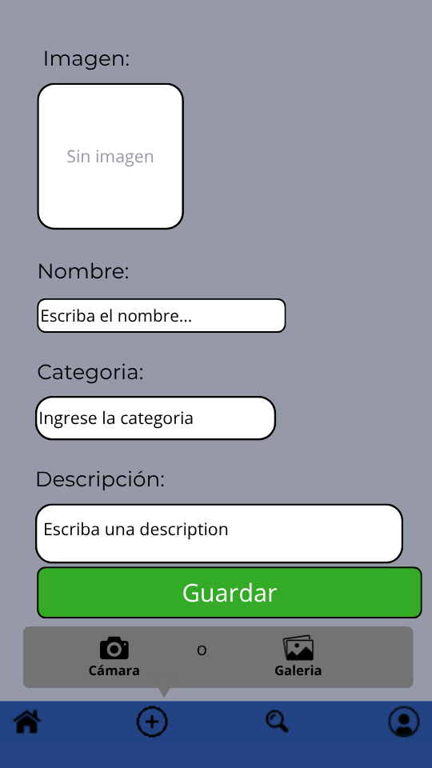
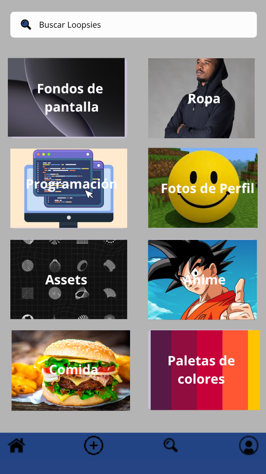
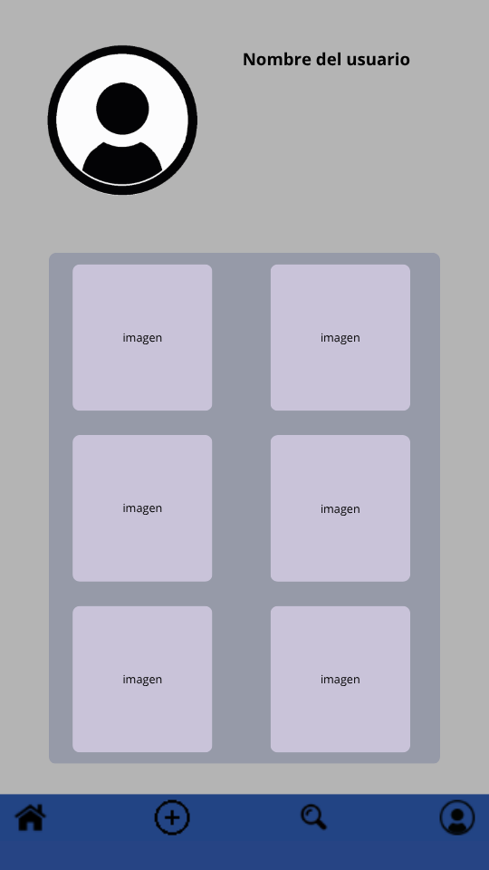

# Requisitos minomos

- Node: v24.18.0

- NPM: 11.16.0

# Objetivo

Crear una apliacion que inspirar a la gente que esta en el area creativa, o simplemente pasar el rato.

# Como se dividieron las tareas: 

- Lauty:

Backend, creación de la base de datos, conecciones del frontend con el backend y documentacion.

- Marcos: 

Frontend, creacion de las plantillas, busqueda de assets e iconos y funcionalidades de cada pantalla.

# Esquema de diagrama de base de datos: 

ACLARACION: Se usa INTREGRER o TEXT, ya que la base de datos usada es SQLite, y los tipos son dististintos.

# Croquies de cada pantalla:

Pantalla de Inicio

Pantalla crear

Pantalla buscar

Pantalla perfil

